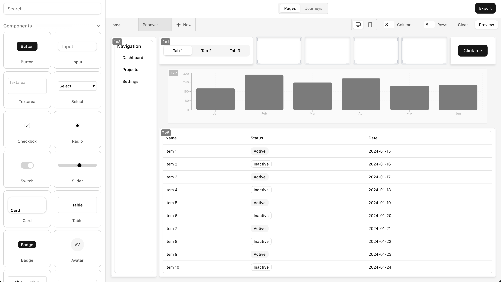
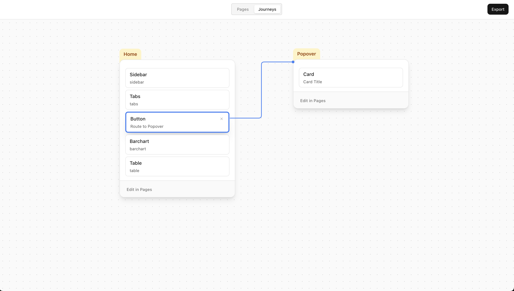
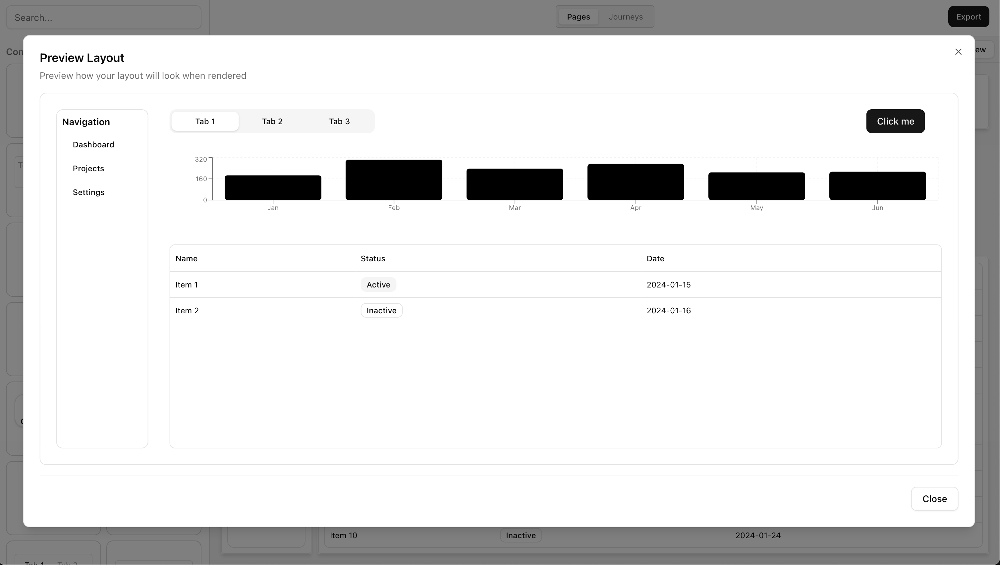
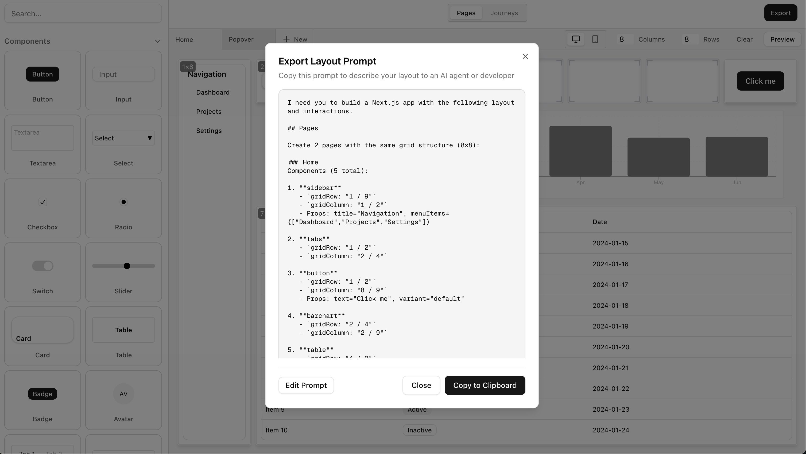

# Mockingbird

A visual wireframing tool for rapid prototyping and user journey mapping. Built with Next.js and shadcn/ui, Mockingbird helps designers and developers create layouts and generate AI-ready prompts for code generation.


*Wireframe editor with drag-and-drop components*


*User journey mapping with visual flow connections*


*Preview your layout before exporting*


*Generate AI-ready prompts from your wireframes*

## Features

**Visual Wireframing**
- Drag-and-drop component placement on a customizable grid
- Pre-built shadcn/ui component library
- Desktop and mobile preview modes
- Real-time property editing

**Journey Mapping**
- Connect components to pages to visualize user flows
- Multi-page project support
- Interactive connection management

**AI-Powered Export**
- Generate detailed prompts for AI code generation
- CSS Grid layout with explicit positioning
- One-click copy for sharing with AI assistants

**Persistence**
- Automatic local storage saves
- Session recovery
- Multi-page project management

## Getting Started

### Prerequisites
- Node.js 18+ 
- npm, yarn, pnpm, or bun

### Installation

1. Clone the repository:
```bash
git clone https://github.com/yourusername/mockingbird.git
cd mockingbird
```

2. Install dependencies:
```bash
npm install
# or
yarn install
# or
pnpm install
```

3. Run the development server:
```bash
npm run dev
# or
yarn dev
# or
pnpm dev
```

4. Open [http://localhost:3000](http://localhost:3000) in your browser

## Usage

**Creating a Wireframe**
1. Drag components from the sidebar onto the grid
2. Resize and position components using resize handles
3. Click a component to edit its properties
4. Adjust grid dimensions using row/column controls

**Mapping User Journeys**
1. Switch to the "Journeys" tab
2. Click a component, then click a destination page to create a connection
3. Click "Edit in Pages" to return to the wireframe view

**Exporting Your Design**
1. Click the Export button
2. Copy the generated prompt
3. Paste into your AI coding assistant (Cursor, Claude, ChatGPT, etc.)

## Tech Stack

- [Next.js 15](https://nextjs.org/)
- [React 19](https://react.dev/)
- [TypeScript](https://www.typescriptlang.org/)
- [Tailwind CSS](https://tailwindcss.com/)
- [shadcn/ui](https://ui.shadcn.com/)
- [Recharts](https://recharts.org/)

## Project Structure

```
mockingbird/
├── src/
│   ├── app/              # Next.js app router
│   ├── components/       # React components
│   │   ├── ui/          # shadcn/ui components
│   │   ├── WireframeGrid.tsx
│   │   ├── ComponentSidebar.tsx
│   │   ├── JourneyCanvas.tsx
│   │   └── ExportModal.tsx
│   ├── lib/             # Utilities
│   └── hooks/           # Custom React hooks
└── public/              # Static assets
```

## License

This project is open source and available under the [MIT License](LICENSE).
